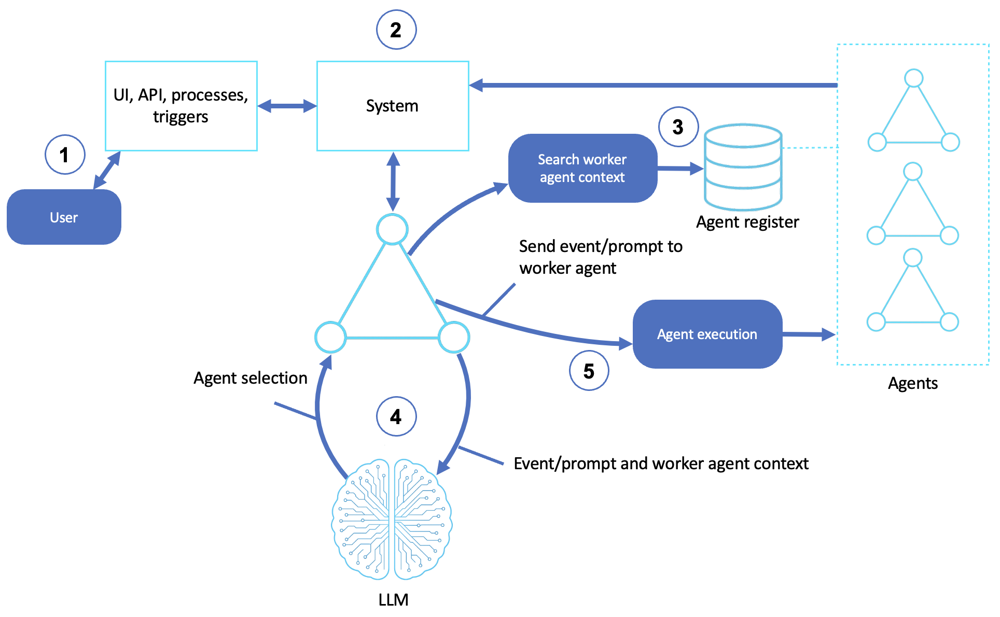

# Workflow Orchestration Agents

Agents that coordinate multistep work by delegating to specialized sub-agents, tracking execution state, and adapting to intermediate results

This sample composes multi-agent workflows with the [Strands Agents SDK](https://strandsagents.com/) and is based off of the [AWS Prescriptive Guidance - Workflow orchestration agents pattern](https://docs.aws.amazon.com/prescriptive-guidance/latest/agentic-ai-patterns/workflow-orchestration-agents.html).

## Table of Contents

- [Quick Start](#quick-start)
- [Orchestration Workflows](#orchestration-workflows)
  - [How It Works](#how-it-works)
  - [Sequential: A Pipeline](#sequential-a-pipeline)
  - [Parallel: Fan-Out / Fan-In](#parallel-fan-out--fan-in)
  - [Conditional: A Router](#conditional-a-router)
- [AWS Implementation Patterns](#aws-implementation-patterns)
- [Reference](#reference)

## Quick Start

**Prerequisites:**
- Python 3.10+
- An AWS account with Amazon Bedrock access
- AWS credentials configured (`aws configure`) with permission to invoke models on Bedrock

```bash
# Create and activate virtual environment
python3 -m venv venv
source venv/bin/activate  # On Windows: venv\Scripts\activate

# Install dependencies
pip install -r requirements.txt

# Point the sample at your AWS profile and region (loaded by shared/model.py)
cp .env.example .env
# Edit .env: set AWS_PROFILE and AWS_REGION. Optionally pin a model with STRANDS_MODEL_ID.

# Run any of the three orchestration patterns
python sequential_workflow.py    # Researcher -> Analyst -> Writer
python parallel_workflow.py      # Technical + Business + Risk -> Synthesizer
python conditional_workflow.py   # Router -> the right specialist
```

**Try these exercises:**
1. **Watch the pipeline.** Run `sequential_workflow.py` and watch each agent's status line flip from `⟳` to `✓` with its elapsed time.
2. **Feel the parallelism.** Run `parallel_workflow.py` and note the total time is close to the *slowest* agent, not the sum of all three.
3. **Trace the routing.** In `conditional_workflow.py`, give it a coding task then a writing task and confirm the router picks a different specialist each time.
4. **Add a stage.** Insert a fourth agent (e.g., an Editor) into the sequential pipeline and pass the previous stage's output into it.

---

## Orchestration Workflows

A single agent reasons and acts in one loop. An orchestration workflow breaks a task into stages and assigns each to a specialized agent, passing results between them. This sample builds the three foundational patterns — **sequential**, **parallel**, and **conditional** — which combine into almost any larger flow.

### How It Works

1. **Receives user input**: a user or external trigger initiates a task through a UI, API, or system event
2. **Handles system events**: a component receives the request and emits an event or command that requires orchestration
3. **Retrieves context**: the workflow agent queries knowledge bases and agent registries to find the right worker agent based on metadata, domain, and prior success
4. **Selects an LLM agent**: an LLM picks the best agent or workflow plan for the task, and may formulate task-specific prompts for it
5. **Delegates and executes**: the chosen worker agent runs, tracking execution state, retrying on failure, and passing intermediate results to the next agent in the sequence



> **Note:** In this sample the orchestration is in plain Python so the control flow is visible. Production systems often hand this to managed orchestrators like [AWS Step Functions](https://aws.amazon.com/step-functions/). For *why* you'd decompose a task across agents and how the three patterns compare, see the [companion blog](Orchestrating%20Agents%20-%20Sequential%2C%20Parallel%2C%20and%20Conditional%20Workflows.md).

### Sequential: A Pipeline

The [sequential workflow](sequential_workflow.py) chains three specialized agents, each consuming the previous one's output: **Researcher → Analyst → Writer**. The orchestration is just three calls in order, with each result fed into the next prompt:

```python
research = researcher_agent(f"Research this topic: {topic}")
analysis = analyst_agent(f"Analyze these findings:\n{research}")
report   = writer_agent(f"Write a report from this analysis:\n{analysis}")
```

Use a pipeline when each stage depends on the one before it. The sample prints a live `⟳`/`✓` status line per stage so you can watch the handoffs.

### Parallel: Fan-Out / Fan-In

The [parallel workflow](parallel_workflow.py) runs three independent analyses at once — **Technical, Business, Risk** — then a **Synthesizer** merges them. Because the three don't depend on each other, they run concurrently with `invoke_async` and `asyncio.gather`:

```python
results = await asyncio.gather(
    technical_agent.invoke_async(prompt),
    business_agent.invoke_async(prompt),
    risk_agent.invoke_async(prompt),
)
synthesis = synthesizer_agent(f"Combine these analyses:\n{results}")
```

Use fan-out/fan-in when subtasks are independent — total time tracks the *slowest* branch rather than the sum, the same concurrency idea Strands uses for tools.

### Conditional: A Router

The [conditional workflow](conditional_workflow.py) classifies the request first, then delegates to the matching specialist: **Router → (Code | Writing | Analysis) agent**. The router only classifies — it doesn't answer — which keeps routing decisions clean and cheap:

```python
category = router_agent(f"Classify this request: {user_input}")   # e.g. "code"
specialist = SPECIALISTS[category]
response = specialist(user_input)
```

Use a router when different request types need genuinely different expertise. It's the multi-agent version of the dispatch idea — one entry point, many specialized handlers.

---

## AWS Implementation Patterns

| Pattern | Description | Reference |
|---------|-------------|-----------|
| Workflows on Step Functions | Orchestrate generative AI workflows with Amazon Bedrock and AWS Step Functions | [Orchestrate generative AI workflows with Amazon Bedrock and AWS Step Functions](https://aws.amazon.com/blogs/machine-learning/orchestrate-generative-ai-workflows-with-amazon-bedrock-and-aws-step-functions/) |
| Advanced Strands orchestration | Customize agent workflows with advanced orchestration techniques using Strands Agents | [Customize agent workflows with advanced orchestration techniques using Strands Agents](https://aws.amazon.com/blogs/machine-learning/customize-agent-workflows-with-advanced-orchestration-techniques-using-strands-agents/) |
| Serverless multi-agent systems | Build highly scalable serverless multi-agent systems on AWS with Amazon Bedrock AgentCore | [Build highly scalable serverless LangGraph multi-agent systems in AWS with Amazon Bedrock AgentCore](https://aws.amazon.com/blogs/machine-learning/build-highly-scalable-serverless-langgraph-multi-agent-systems-in-aws-with-amazon-bedrock-agentcore/) |
| Multi-agent operational workflow | Scale content-review operations with a multi-agent workflow | [Scaling content review operations with multi-agent workflow](https://aws.amazon.com/blogs/machine-learning/scaling-content-review-operations-with-multi-agent-workflow/) |

## Reference

- [Companion blog post: Orchestrating Agents](Orchestrating%20Agents%20-%20Sequential%2C%20Parallel%2C%20and%20Conditional%20Workflows.md)
- [AWS Prescriptive Guidance - Workflow orchestration agents](https://docs.aws.amazon.com/prescriptive-guidance/latest/agentic-ai-patterns/workflow-orchestration-agents.html)
- [Strands multi-agent workflow example](https://strandsagents.com/docs/examples/python/agents_workflows/)
- [AWS Step Functions](https://aws.amazon.com/step-functions/)
- [Amazon Bedrock User Guide](https://docs.aws.amazon.com/bedrock/latest/userguide/what-is-bedrock.html)

### The series

This sample is one of eleven, one per pattern in the [AWS Prescriptive Guidance on agentic AI patterns](https://docs.aws.amazon.com/prescriptive-guidance/latest/agentic-ai-patterns/). Each has a hands-on sample repository and a companion blog post explaining the concepts.

| # | Pattern | Sample | Blog |
|---|---|---|---|
| 01 | Basic Reasoning Agents | [sample-basic-reasoning-agents](https://github.com/aws-samples/sample-basic-reasoning-agents) | [Building Basic Reasoning Agents with Amazon Bedrock and Strands SDK](https://github.com/aws-samples/sample-basic-reasoning-agents/blob/main/Building%20Basic%20Reasoning%20Agents%20with%20Amazon%20Bedrock%20and%20Strands%20SDK.md) |
| 02 | Tool-Based Agents (Functions) | [sample-tool-based-agents-functions](https://github.com/aws-samples/sample-tool-based-agents-functions) | [Extending AI Agents with Custom Tools and Functions](https://github.com/aws-samples/sample-tool-based-agents-functions/blob/main/Extending%20AI%20Agents%20with%20Custom%20Tools%20and%20Functions.md) |
| 03 | Tool-Based Agents (Servers) | [sample-tool-based-agents-servers](https://github.com/aws-samples/sample-tool-based-agents-servers) | [Delegating Work: Tool Servers and the Model Context Protocol](https://github.com/aws-samples/sample-tool-based-agents-servers/blob/main/Delegating%20Work%20-%20Tool%20Servers%20and%20the%20Model%20Context%20Protocol.md) |
| 04 | Computer-Use Agents | [sample-computer-use-agents](https://github.com/aws-samples/sample-computer-use-agents) | [Agents That Use Computers: Browsers, Desktops, and the GUI Frontier](https://github.com/aws-samples/sample-computer-use-agents/blob/main/Agents%20That%20Use%20Computers%20-%20Browsers%2C%20Desktops%2C%20and%20the%20GUI%20Frontier.md) |
| 05 | Coding Agents | [sample-coding-agents](https://github.com/aws-samples/sample-coding-agents) | [Coding Agents: From Autocomplete to Autonomous Software Work](https://github.com/aws-samples/sample-coding-agents/blob/main/Coding%20Agents%20-%20From%20Autocomplete%20to%20Autonomous%20Software%20Work.md) |
| 06 | Speech and Voice Agents | [sample-speech-voice-agents](https://github.com/aws-samples/sample-speech-voice-agents) | [Giving Agents a Voice: Speech-to-Speech and the STT/TTS Pipeline](https://github.com/aws-samples/sample-speech-voice-agents/blob/main/Giving%20Agents%20a%20Voice%20-%20Speech-to-Speech%20and%20the%20STT-TTS%20Pipeline.md) |
| 07 | Workflow Orchestration Agents | this repository | [Orchestrating Agents: Sequential, Parallel, and Conditional Workflows](Orchestrating%20Agents%20-%20Sequential%2C%20Parallel%2C%20and%20Conditional%20Workflows.md) |
| 08 | Memory-Augmented Agents | [sample-memory-augmented-agents](https://github.com/aws-samples/sample-memory-augmented-agents) | [Agents That Remember: Context Windows, Summaries, and Persistent Sessions](https://github.com/aws-samples/sample-memory-augmented-agents/blob/main/Agents%20That%20Remember%20-%20Context%20Windows%2C%20Summaries%2C%20and%20Persistent%20Sessions.md) |
| 09 | Simulation and Test-Bed Agents | [sample-simulation-testbed-agents](https://github.com/aws-samples/sample-simulation-testbed-agents) | [Practice Worlds: Simulation and Test-Bed Agents](https://github.com/aws-samples/sample-simulation-testbed-agents/blob/main/Practice%20Worlds%20-%20Simulation%20and%20Test-Bed%20Agents.md) |
| 10 | Observer and Monitoring Agents | [sample-observer-monitoring-agents](https://github.com/aws-samples/sample-observer-monitoring-agents) | [Watching the Watched: Observer and Monitoring Agents](https://github.com/aws-samples/sample-observer-monitoring-agents/blob/main/Watching%20the%20Watched%20-%20Observer%20and%20Monitoring%20Agents.md) |
| 11 | Multi-Agent Collaboration | [sample-multi-agent-collaboration](https://github.com/aws-samples/sample-multi-agent-collaboration) | [When Multi-Agent Collaboration Earns Its Cost](https://github.com/aws-samples/sample-multi-agent-collaboration/blob/main/When%20Multi-Agent%20Collaboration%20Earns%20Its%20Cost.md) |

## Security

See [CONTRIBUTING](CONTRIBUTING.md#security-issue-notifications) for more information.

## License

This library is licensed under the MIT-0 License. See the LICENSE file.
